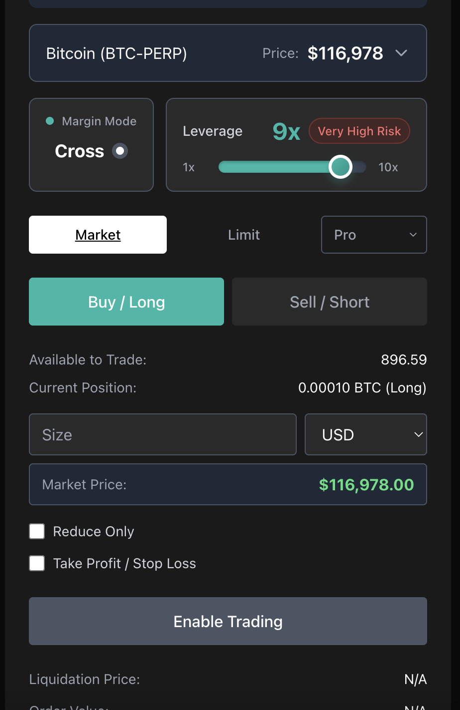

# Hyperliquid Trading Interface

A simple trading interface for Hyperliquid that supports Market, Limit, Scale, and TWAP orders with advanced leverage and margin mode controls, real-time price updates, and sophisticated order management.

## 🖼️ Interface Preview

Here's what the trading interface looks like:



*The interface features a dark theme with teal/green accents, showing Margin Mode (Cross), Leverage control (9x with risk indicator), Market/Limit order selection, Buy/Sell buttons, and comprehensive order parameters.*

## 📹 Demo Videos

Watch these demonstration videos to understand the functionality:

- **[Market Order Demo](https://www.loom.com/share/47cff0dc410b4dcc86b35a1323d59077?sid=a79e74a0-07de-46c6-95a8-24ba1c8c859f)** - See how to execute orders immediately at current market price

- **[Limit Order Demo](https://www.loom.com/share/8392967a459e47fea42ba7a4d8c1fbc4?sid=dca3765e-0c26-4b68-ac4d-11dc3c2a3f4c)** - Understand how to place orders at specific price levels

- **[TWAP Order Demo](https://www.loom.com/share/f113a7fc83764f188b9828587bd3aaf6?sid=4f8c6cbf-881f-4cd3-9fbd-d8a99e0e269c)** - See how to execute orders over time to reduce market impact

- **[Scale Order Demo](https://www.loom.com/share/5feaa6e04e904bc5bd75d53d2f387994?sid=c364f19f-f0f5-46b6-bb41-9dafb2a5d4b6)** - Learn how to place multiple orders at different price levels with size skew

## ✨ Features

- **Order Types**: Market, Limit, Scale, TWAP orders with advanced validation
- **Leverage Control**: Dynamic leverage updates up to 10x with risk indicators
- **Margin Modes**: Switch between Isolated and Cross margin
- **Real-time Data**: Live price feeds, account balance, and position tracking
- **Advanced UI**: Dark theme, toast notifications, responsive design
- **Security**: Environment variable configuration for private keys

## 🚀 Quick Start

### Prerequisites
- Node.js 18+
- npm or yarn
- Modern web browser

### 1. Install Dependencies
```bash
git clone <repository-url>
cd hyperliquid-minidemo
npm install
```

### 2. Configure Environment
```bash
# Copy environment template
cp .env.example .env

# Edit your private key
nano .env
```

Set your private key in `.env`:
```env
PRIVATE_KEY=0xYOUR_PRIVATE_KEY_HERE
USE_TESTNET=true
DEFAULT_COIN=BTC-PERP
```

### 3. Run the Application
```bash
# Start development server
npm run dev

# The application will be available at:
# http://localhost:5173
```

### 4. Run Tests (Optional)
```bash
# Run all tests
npm test

# Run with coverage
npm run test:coverage
```

## 📚 Documentation

- **[Environment Variables Setup](ENV_SETUP.md)** - Complete setup guide
- **[Test Coverage Report](src/__tests__/TEST_COVERAGE_REPORT.md)** - Testing details

## 🛠️ Development

### Available Scripts
```bash
npm run dev          # Start development server
npm run build        # Build for production
npm run preview      # Preview production build
npm test            # Run tests
npm run test:coverage # Run tests with coverage
npm run lint        # Check code quality
```

### Project Structure
```
src/
├── components/          # React components
├── hooks/              # Custom React hooks
├── services/           # API services
├── config/             # Configuration files
└── __tests__/          # Test files
```

## 🔒 Security

- Never commit private keys to version control
- Always use testnet for development
- Keep your `.env` file secure
- Use environment variables for production

## 📄 License

MIT License

## ⚠️ Disclaimer

This is a demonstration project for educational purposes. Trading cryptocurrencies involves significant risk. Always do your own research and never trade with money you cannot afford to lose.